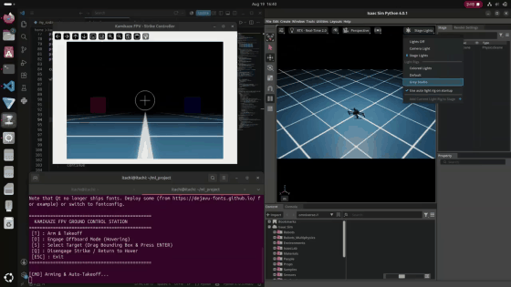

# Autonomous Tracking in NVIDIA Isaac Sim (PX4 + ROS2 + PyQt6 GCS)

[](LICENSE)
[]()
[]()
[]()
[]()

> A complete software-in-the-loop (SITL) digital twin architecture running on Ubuntu to validate autonomous visual servoing and precision targeting before physical hardware deployment. Features a custom Python/PyQt6 Ground Control Station processing asynchronous video and telemetry feeds, an OpenCV tracking pipeline calculating real-time pixel offsets ($dx/dy$), and dynamic manual override via MAVLink into PX4 offboard control.

---

## 📽️ Demo & Simulation Recording

Split-screen simulation recording demonstrating the **Kamikaze FPV Strike Controller** on the left with targeting crosshair and trajectory guidance, and **NVIDIA Isaac Sim** quadcopter physics simulation on the right:



---

## 🏗️ System Architecture

```
┌─────────────────────────────────────────────────────────────┐
│ NVIDIA Isaac Sim 4.0.1 (RTX Physics, Aerodynamics, Sensors) │
└──────────────┬───────────────────────────────▲──────────────┘
               │ (Synthetic 30 FPS Video Feed) │ (Offboard Setpoint)
               ▼                               │
┌──────────────────────────────┐ ┌─────────────┴──────────────┐
│ OpenCV Perception Pipeline   │ │ PX4 Autopilot SITL         │
│ - Pixel Error Calc (dx/dy)   │ │ - Full flight dynamics     │
└──────────────┬───────────────┘ └─────────────▲──────────────┘
               │                               │
               ▼ (Velocity Vector Cmd)         │ (MAVLink Offboard Mode)
┌──────────────────────────────────────────────┴──────────────┐
│ Custom PyQt6 Ground Control Station (GCS)                   │
│ - Asynchronous video ingestion & HUD telemetry rendering    │
│ - Manual Override / Autonomous Target Tracking Lock         │
└─────────────────────────────────────────────────────────────┘
```

---

## ⚙️ Key Technical Challenges & Solutions

### 1. Zero Hardware Risk Pre-Flight Validation
* **Problem:** Direct field testing of aggressive visual servoing maneuvers on prototype quadcopters carries high crash risks and damages expensive companion computers and camera sensors.
* **Solution:** Replicated quadcopter aerodynamics, camera sensor parameters, and dynamic ground targets in NVIDIA Isaac Sim. Perception algorithms calculate pixel offsets ($dx/dy$) against synthetic RTX camera streams, closing the loop with PX4 SITL over bi-directional MAVLink bridges.

### 2. Low-Latency Asynchronous Telemetry & Video Processing
* **Problem:** Streaming video and high-rate MAVLink state data simultaneously into the GCS interface caused severe event loop locking and control lag.
* **Solution:** Architected dedicated background threads in PyQt6 to ingest video and telemetry asynchronously. When a target is acquired, the OpenCV tracking pipeline overrides manual operator input and transmits direct velocity setpoints to the flight controller at 20 Hz.

---

## 🛠️ Stack & Dependencies
* **Simulation:** NVIDIA Isaac Sim 4.0+ (Omniverse)
* **Autopilot Stack:** PX4 Autopilot (v1.14+), MicroXRCE-DDS Agent
* **Middleware:** ROS2 Humble Hawksbill
* **Ground Station:** PyQt6, Python 3.10+
* **Communications:** MAVLink, pymavlink, pyzmq

---

## 🚀 Quickstart & Reproduction

### 1. Clone Repo & Install Requirements
```bash
git clone https://github.com/amanullah7x/uav-isaac-sim-digital-twin.git
cd uav-isaac-sim-digital-twin
pip install -r requirements.txt
```

### 2. Run Visual Servoing Simulation Controller
```bash
python ros2_offboard_tracker.py --duration 5.0
```

### 3. Launch Complete SITL Pipeline
```bash
# Terminal 1: Launch PX4 SITL
make px4_sitl none_iris

# Terminal 2: Start micro-ROS agent
MicroXRCEAgent udp4 -p 8888

# Terminal 3: Run offboard visual servoing node
python ros2_offboard_tracker.py
```
